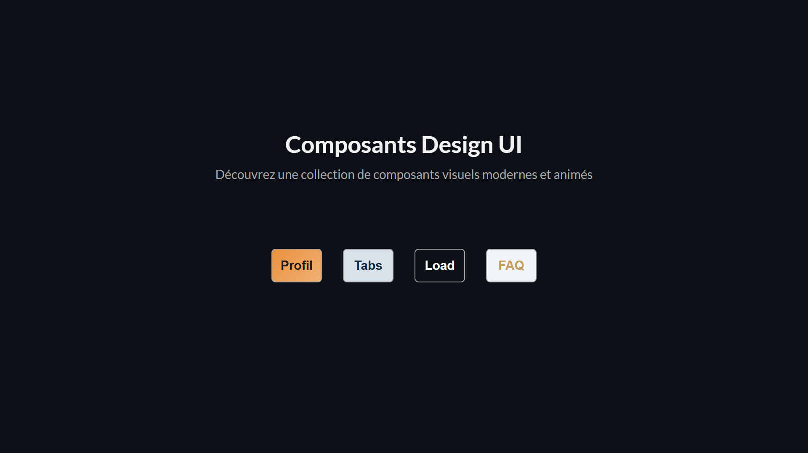

<div align="center">  
  <a href="https://components-modern.vercel.app" target="_blank">  
      
  </a>  
  </br></br>  
  <h3 align="center">🎨 Composants UI Modernes</h3>  
</div>

## <br /> 📌 Sommaire

&nbsp;&nbsp;&nbsp; 🎨 &nbsp; [**Introduction**](#introduction)<br />
&nbsp;&nbsp;&nbsp; 🛠️ &nbsp; [**Technologies**](#technologies)<br />
&nbsp;&nbsp;&nbsp; 🎯 &nbsp; [**Fonctionnalités**](#fonctionnalités)<br />
&nbsp;&nbsp;&nbsp; 🚀 &nbsp; [**Installation**](#installation)<br />

## <br /> <a name="introduction">🎨 Introduction</a>

Ce projet regroupe une série de composants UI animés sous React, destinés à enrichir visuellement n’importe quelle application web.

Chaque composant est autonome, stylisé avec soin et pensé pour être modulaire, responsive et réutilisable facilement.

La collection comprend notamment :

- Un effet de texte
- Une section de carte de tarification
- Des cartes de profils esthétiques
- Un système d’onglets (Tabs)
- Une page de chargement animée
- Un menu déroulant animé
- Une barre de recherche animée
- Un décompte dynamique
- Un curseur de sélection animé
- Un bouton flottant avec menu radial
- Un bouton de retour en haut de page
- Un affichage graphique au rythme de la musique

## <br /> <a name="technologies">🛠️ Technologies</a>

- React 18 avec `create-react-app`
- CSS natif modulaire (1 fichier par composant)
- Hooks React : `useState`, `useEffect`, `useRef`
- Framer Motion pour les animations de menu ou reveal
- Remix Icons & React Icons
- Responsive Design
- Déployé avec [**Vercel**](https://components-modern.vercel.app)

## <br /> <a name="fonctionnalités">🎯 Fonctionnalités</a>

- UI soignée avec animations fluides
- Composants full responsive
- Composants autonomes et réutilisables
- Animations CSS + JS + Framer Motion
- Visualisation de l’audio avec `<canvas>`
- Prêts à l’emploi pour tout projet React

## <br /> <a name="installation">🚀 Installation</a>

### ✅ Prérequis

- [Git](https://git-scm.com/) &nbsp;—&nbsp; Système de gestion de versions
- [Node.js](https://nodejs.org/fr) &nbsp;—&nbsp; Exécuteur local de scripts JavaScript
- [npm](https://www.npmjs.com/) &nbsp;—&nbsp; Gestionnaire de paquets JavaScript
- [Google Chrome](https://www.google.com/) &nbsp;—&nbsp; Navigateur moderne
- [Visual Studio Code](https://code.visualstudio.com/) &nbsp;—&nbsp; Éditeur de code

### 📥 Cloner le projet

```bash
git clone https://github.com/ValentinMadiot/components-modern_ui
cd components-modern_ui
```

### ▶️ Lancer le projet

#### Frontend

```bash
npm install
npm start
```

Frontend disponible sur : `http://localhost:3000`
